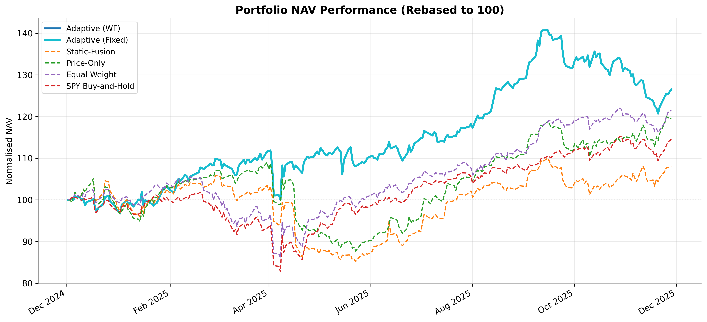
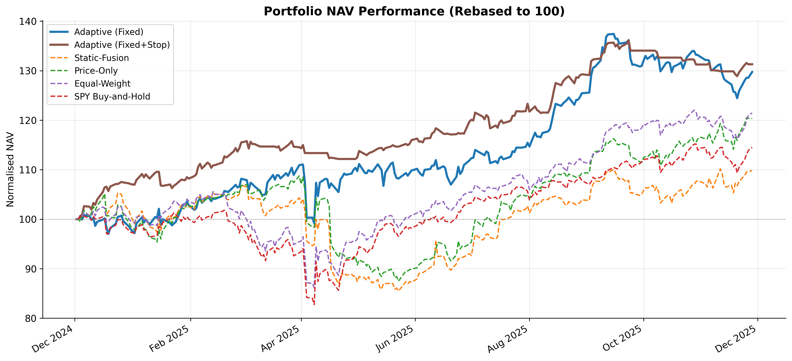
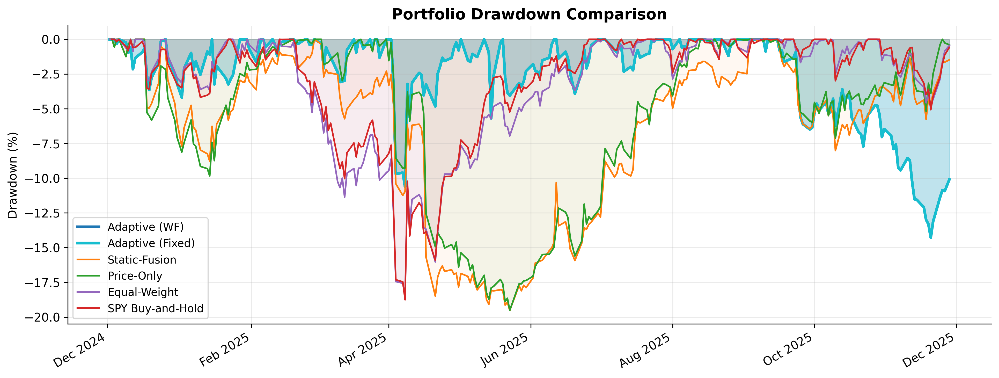
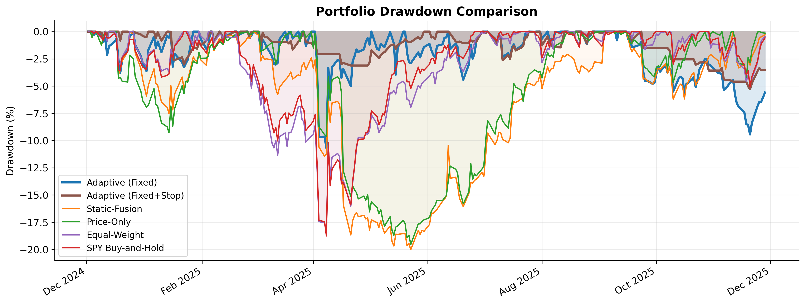
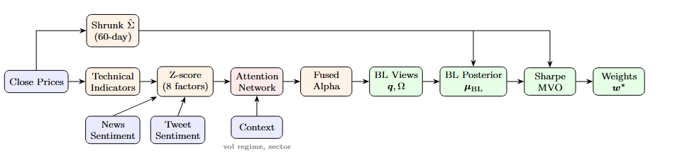
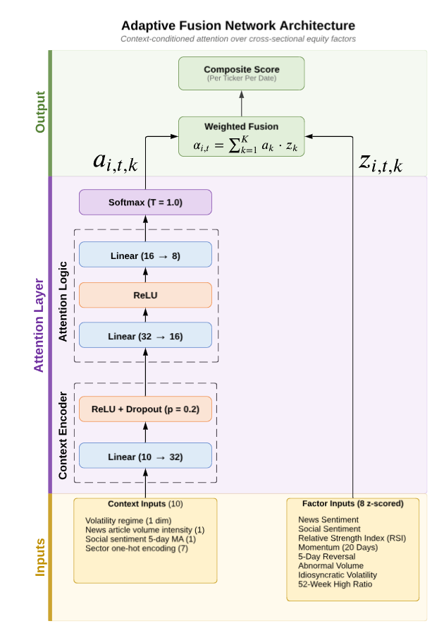
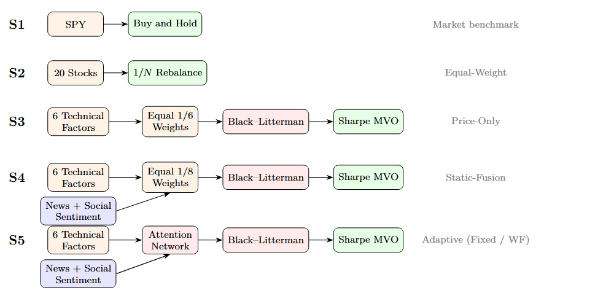
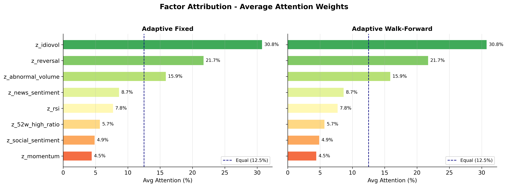
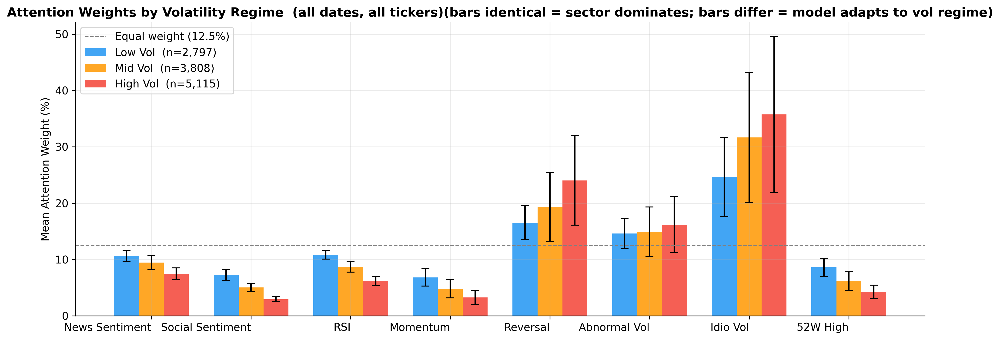
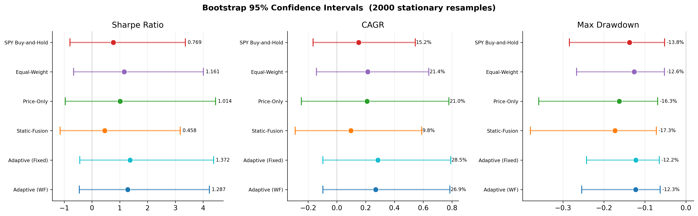

# Adaptive Multi-source Sentiment Fusion For Portfolio Optimisation

A context-conditioned attention network for adaptive multi-source sentiment fusion in Black-Litterman portfolio optimisation. The system dynamically weights eight factor signals (news sentiment, social sentiment, and six technical indicators) based on volatility regime, data availability, and sector characteristics.

**Author:** Alasteir Ho Zhen Wei  
**Student ID:** 001295065  
**Institution:** University of Greenwich (COMP1682 Final Year Project)  
**Supervisor:** Dr Ali Jazdarreh  
**Date:** April 2026

## Key Results

| Strategy | Sharpe | Ann. Return | Ann. Vol | Max Drawdown | Calmar | Total Return |
|----------|--------|-------------|----------|-------------|--------|-------------|
| **Adaptive (Fixed+Stop)** | **2.51** | **27.76%** | **11.07%** | **-8.36%** | **3.32** | **27.26%** |
| Adaptive (WF) | 1.39 | 29.24% | 20.96% | -13.54% | 2.16 | 28.71% |
| Adaptive (Fixed) | 1.39 | 29.24% | 20.96% | -13.54% | 2.16 | 28.71% |
| Equal-Weight (1/N) | 1.12 | 21.76% | 19.46% | -18.44% | 1.18 | 21.47% |
| Price-Only | 0.93 | 19.88% | 21.42% | -19.52% | 1.02 | 19.53% |
| SPY Buy-and-Hold | 0.75 | 14.84% | 19.84% | -18.76% | 0.79 | 14.54% |
| Static-Fusion | 0.28 | 6.14% | 21.82% | -21.56% | 0.28 | 6.04% |

The top-performing strategy, Adaptive (Fixed+Stop), adds a 2.0% per-position stop-loss (calibrated from the cross-ticker mean intraday drawdown on the model training window, pre-backtest) to the adaptive fusion model. This lifted the Sharpe ratio by 81% (1.39 to 2.51) by almost halving annualised volatility (20.96% to 11.07%) and cutting maximum drawdown by 38% (-13.54% to -8.36%), at the cost of a small decrease in total return (28.71% to 27.26%). 73 stop-outs were triggered during the backtest period. A true post-backtest out-of-sample check (Jan-Apr 2026, ~95 trading days) showed both Adaptive variants under-performed SPY and Equal-Weight, indicating the backtest-period gains are regime-sensitive; see Chapter 6 §6.2.9 for detail.

Both Adaptive variants delivered comparable risk (volatility and maximum drawdown within 1-2 percentage points of each other), with Walk-Forward offering modestly higher Sharpe and total return through continuous retraining every 10 trading days. This indicates that the pre-trained attention weights already generalise well, and that retraining provides incremental rather than transformative improvements.

### Portfolio NAV Performance

<p align="center">
  
</p>

<p align="center">
  
</p>

### Drawdown Comparison

<p align="center">
  
</p>

<p align="center">
  
</p>

## Overview

The system performs the following pipeline:

1. **Data Collection** -- Scrapes financial news headlines from the GDELT API and tweets from X/Twitter via Selenium-based browser automation for 20 S&P 500 stocks across 7 sectors
2. **Sentiment Model** -- Fine-tunes a custom FIN-RoBERTa classifier from RoBERTa-base on four financial sentiment datasets (99.6% accuracy on Financial PhraseBank)
3. **Preprocessing** -- Cleans, deduplicates, and labels data using the custom model, then aggregates into daily sentiment scores per ticker
4. **Adaptive Fusion & Portfolio Optimisation** -- A PyTorch attention network produces context-dependent factor weights over 8 signals, integrated into a Black-Litterman framework and optimised via Sharpe ratio maximisation
5. **Walk-Forward Backtest** -- Evaluates strategies over ~252 trading days with realistic transaction costs (SEC/FINRA fees + 5 bps slippage)
6. **Stop-Loss Ablation** -- Tests the impact of a 2.0% per-position stop-loss rule on the best-performing adaptive strategy
7. **Streamlit Web Application** -- Three-page interactive demo with data collection, model training, and portfolio simulation with animated playback

## Architecture

### Portfolio Optimisation Pipeline

<p align="center">
  
</p>

Close prices feed into technical indicator computation and a Ledoit-Wolf shrinkage covariance matrix (60-day rolling window). News and tweet sentiment scores join the technical factors to form 8 Z-scored signals. The attention network, conditioned on volatility regime and sector context, produces adaptive factor weights that fuse the signals into a composite alpha score. These alpha scores become views in the Black-Litterman framework, which combines market equilibrium priors with the model's views to produce posterior expected returns. A Sharpe ratio maximiser (SLSQP) then determines optimal portfolio weights.

### Adaptive Fusion Network

<p align="center">
  
</p>

The context-conditioned attention network takes 10 context inputs (volatility regime tercile, news/social intensity, 7 sector one-hots) and produces 8 factor weights via softmax:

```
Context (10-dim) --> FC(32) --> ReLU --> Dropout(0.2)
                 --> FC(16) --> ReLU
                 --> FC(8)  --> Softmax --> Factor Weights

8 Z-scored Factors x Factor Weights --> Composite Alpha Score
```

The network is trained by maximising the information coefficient (IC) between predicted alpha scores and next-day cross-sectional returns.

### Strategy Hierarchy

<p align="center">
  
</p>

Five strategies of increasing complexity are compared to isolate the contribution of each component: market benchmark (S1), equal-weight diversification (S2), technical-only factors (S3), static sentiment fusion (S4), and adaptive NN-based fusion (S5).

### Factor Attribution

<p align="center">
  
</p>

The attention network allocates the majority of weight to risk-based technical factors: idiosyncratic volatility (32.1%), 5-day reversal (20.9%), and abnormal volume (15.4%) account for 68.4% of the attention budget. News sentiment (8.8%) and social sentiment (4.5%) receive a combined 13.3%, indicating that sentiment serves as a complementary signal rather than the primary alpha driver for this large-cap universe.

### Volatility Regime Adaptation

<p align="center">
  
</p>

The model adapts its factor weighting based on the prevailing volatility regime. In high-volatility periods, the network increases weight on idiosyncratic volatility and RSI (mean-reversion signals), while in low-volatility periods it allocates relatively more to sentiment and momentum signals. This regime-conditional behaviour is learned end-to-end without explicit rules.

### Bootstrap Confidence Intervals

<p align="center">
  
</p>

Statistical robustness is assessed via 2,000 stationary bootstrap resamples with geometric block length of 10 days. While the Adaptive strategies show higher point estimates across all metrics, the 95% confidence intervals overlap across strategies, reflecting the inherent uncertainty of a single 252-day evaluation window.

## Supported Stocks

20 large-cap S&P 500 stocks across 7 GICS sectors:

| Sector | Tickers |
|--------|---------|
| Technology | NVDA, AAPL, MSFT, AVGO, ORCL |
| Communication Services | GOOGL, META |
| Consumer Discretionary | AMZN, TSLA, HD |
| Financial Services | BRK-B, JPM, V, MA |
| Healthcare | JNJ, LLY, UNH |
| Consumer Staples | WMT, PG |
| Energy | XOM |

## Eight Factor Signals

| Factor | Source |
|--------|--------|
| News sentiment | FIN-RoBERTa on GDELT headlines |
| Social sentiment | FIN-RoBERTa on X/Twitter posts |
| RSI (14-day) | Close prices |
| Momentum (20-day) | Close prices |
| 5-day reversal | Close prices |
| Abnormal volume | Volume data |
| Idiosyncratic volatility | Close prices (20-day rolling std) |
| 52-week high ratio | Close prices |

## Portfolio Construction

Composite alpha scores are integrated into a **Black-Litterman** framework (tau=0.5, delta=2.5) and optimised via **Sharpe ratio maximisation** (SLSQP) with weight bounds [5%, 40%] and top-5 stock selection per rebalance (every 10 trading days).

**Stop-loss extension:** A 2.0% per-position stop-loss (calibrated out-of-sample from the mean intraday drawdown across the 20-stock universe over the model training window) monitors intraday lows against entry prices. When triggered, the position is liquidated at the stop price with one-way slippage and regulatory fees; proceeds are held as idle cash until the next scheduled rebalance.

## Technology Stack

- **Language:** Python 3.13
- **Deep Learning / NLP:** PyTorch, Transformers (RoBERTa), scikit-learn
- **Portfolio Optimisation:** SciPy (SLSQP), Black-Litterman framework
- **Data Handling:** pandas, NumPy, yfinance, exchange-calendars
- **Web Scraping:** Selenium, undetected-chromedriver, gdeltdoc (GDELT API)
- **Language Detection:** lingua-language-detector
- **Visualisation:** Matplotlib, Seaborn, Plotly
- **Demo App:** Streamlit
- **Testing:** pytest (50 unit tests)

## Project Structure

```
Adaptive-Fusion-For-Stock-Portfolio-Optimization/
|-- Dashboard/
|   |-- backend/                      # Python package (9 modules)
|   |   |-- backtest.py               #   Walk-forward backtest engine
|   |   |-- config.py                 #   Centralised hyperparameters
|   |   |-- data.py                   #   Data loading utilities
|   |   |-- features.py               #   Technical factor engineering
|   |   |-- model.py                  #   Attention network and training
|   |   |-- news_preprocessing.py     #   News data preprocessing
|   |   |-- optimizer.py              #   Black-Litterman and Sharpe MVO
|   |   |-- sentiment.py              #   FIN-RoBERTa inference wrapper
|   |   +-- tweets_preprocessing.py   #   Tweet data preprocessing
|   |-- frontend/                     # Streamlit web application
|   |   |-- about.py                  #   System status dashboard
|   |   |-- data_collection.py        #   Data acquisition interface
|   |   +-- portfolio_simulation.py   #   Portfolio simulation page
|   |-- fusion_network.pt             # Warmstart model
|   |-- main.py                       # Streamlit application entry point
|   |-- services/                     # Subprocess managers
|   |   |-- gdelt_runner.py           #   News scraper execution
|   |   |-- sentiment_runner.py       #   Sentiment scoring execution
|   |   +-- twitter_runner.py         #   Tweet scraper execution
|   +-- tests/                        # Unit test suite (pytest)
|       |-- test_features.py          #   20 tests for technical indicators
|       |-- test_model.py             #   13 tests for attention network
|       +-- test_optimizer.py         #   17 tests for BL and MVO
|-- Diagrams/                         # Architecture diagrams and result figures
|-- Portfolio_Optimizer/
|   |-- Adaptive_Fusion_POC.ipynb           # Main research notebook (base backtest)
|   |-- Adaptive_Fusion_POC_StopLoss.ipynb  # Stop-loss ablation notebook
|   +-- fusion_network.pt                   # Pre-trained model weights (Fixed)
|-- Preprocessing/
|   |-- news_preprocessing_labelling.ipynb
|   +-- tweets_preprocessing_labelling.ipynb
|-- Processed_Data/                   # Daily sentiment CSV files
|-- Raw_Data/                         # Unprocessed scraper outputs
|-- README.md
|-- requirements.txt
|-- Scrapers/
|   |-- GDELTscraper.py               # GDELT news headline collection
|   +-- twitter_scraper.py            # Selenium-based tweet collection
+-- Sentiment_Model/
    |-- model_evaluation.ipynb        # FIN-RoBERTa benchmark evaluation
    +-- RoBERTa-Train/                # Fine-tuning scripts and training data
```

## Installation

### Prerequisites

- Python 3.13+
- Conda (recommended) or venv
- Chrome browser (for Twitter scraping)
- NVIDIA GPU with CUDA support (recommended for sentiment inference and NN training)

### Setup

1. **Create conda environment:**
   ```bash
   conda create -n fyp-gpu python=3.13
   conda activate fyp-gpu
   ```

2. **Install PyTorch with CUDA support (recommended):**
   ```bash
   pip3 install torch torchvision --index-url https://download.pytorch.org/whl/cu130
   ```

3. **Install remaining dependencies:**
   ```bash
   pip install -r requirements.txt
   ```

4. **Authenticate with Hugging Face:**
   ```bash
   huggingface-cli login
   ```
   Required to download model weights. Create a token at [huggingface.co/settings/tokens](https://huggingface.co/settings/tokens).

5. **Configure environment variables (for scraping only):**
   Create a `.env` file:
   ```
   TWITTER_USERNAME=your_username
   TWITTER_PASSWORD=your_password
   ```

6. **Download and unpack the dataset:**

   Download the bundled dataset archive from Google Drive:

   [https://drive.google.com/file/d/1fZXP7-HeDjBaVtzZQEIwyxAS4TVGoy52/view?usp=sharing](https://drive.google.com/file/d/1fZXP7-HeDjBaVtzZQEIwyxAS4TVGoy52/view?usp=sharing)

   Unpack the archive into the project root so that the `Raw_Data/` and `Processed_Data/` directories sit alongside `Scrapers/`, `Portfolio_Optimizer/`, and `Dashboard/`. Skipping this step means you will need to run the scrapers and preprocessing notebooks from scratch (Steps 1 through 3 below) to regenerate the data.

## Usage

### Step 1: Collect News Data
```bash
python Scrapers/GDELTscraper.py
```
Collects news headlines via the GDELT Document API. Outputs to `Raw_Data/gdelt_news_data/`.

### Step 2: Collect Twitter Data
```bash
python Scrapers/twitter_scraper.py
```
Scrapes cashtag-mentioning tweets via Selenium browser automation. Outputs to `Raw_Data/Tweets/`.

### Step 3: Preprocess and Label Data
Run the Jupyter notebooks in `Preprocessing/`:
- `news_preprocessing_labelling.ipynb` -- Clean, label with FIN-RoBERTa, aggregate to daily scores
- `tweets_preprocessing_labelling.ipynb` -- Multi-stage filtering, label, aggregate to daily scores

### Step 4: Portfolio Optimisation and Backtest
Run the main notebooks:
- `Portfolio_Optimizer/Adaptive_Fusion_POC.ipynb` -- Trains the attention network, runs walk-forward backtest for all strategies, generates results and visualisations
- `Portfolio_Optimizer/Adaptive_Fusion_POC_StopLoss.ipynb` -- Stop-loss ablation study on the best-performing adaptive strategy

### Step 5: Run Tests
```bash
cd Dashboard
pytest tests/ -v
```

### Step 6: Launch the Streamlit Dashboard
```bash
cd Dashboard
streamlit run main.py
```
This starts the three-page interactive web application on `http://localhost:8501`. The dashboard includes:
- **About** -- System status and GPU/model availability checks
- **Data Collection** -- Run the GDELT and Twitter scrapers and sentiment labelling from the browser
- **Portfolio Simulation** -- Configure and run a backtest with animated NAV playback and strategy comparison

## Models

### Custom FIN-RoBERTa Sentiment Classifier

A RoBERTa-base model (125M parameters) fine-tuned for three-class financial sentiment classification:

- **Hugging Face:** [alasteirho/FIN-RoBERTa-Custom](https://huggingface.co/alasteirho/FIN-RoBERTa-Custom)
- **Labels:** negative, neutral, positive
- **Training data:** Financial PhraseBank, Twitter Financial News Sentiment, FiQA 2018, SemEval 2017 Task 5
- **Benchmark:** 99.6% accuracy on Financial PhraseBank (sentences_allagree, 2,264 samples)

## Key Design Decisions

- **No look-ahead bias:** Signals use T-1 data; trades execute at T open price. Day 0 of the backtest is skipped to enforce strict T-1 discipline.
- **Walk-forward retraining:** The WF variant retrains the attention network at every rebalance (every 10 trading days) using a 3-month (63 trading day) rolling window with warm-starting.
- **No sentiment forward-fill:** Missing sentiment days default to neutral (0) rather than carrying stale values forward; the attention network learns to rely on technical factors when sentiment coverage is sparse.
- **Realistic costs:** SEC fee (0.278 bps on sells), FINRA TAF ($0.000166/share, capped at $8.30), and 5 bps one-way slippage on all trades.
- **Stop-loss rule:** 2.0% per-position stop based on intraday low vs. entry price, calibrated from the mean intraday drawdown of the 20-stock universe over the model training window (pre-backtest) and informed by Han, Zhou & Zhu (2016) and Kaminski & Lo (2014).
- **Statistical robustness:** 2,000 stationary bootstrap resamples with geometric block length of 10 days for confidence intervals.

## Limitations

- **Historical data only:** The system operated entirely on historical Yahoo Finance data. Live deployment was not feasible as paper-trading platforms (such as Alpaca) do not support backtesting on historical data with custom models, and a data-source mismatch exists between Yahoo Finance prices and live execution feeds.
- **Open price execution is unrealistic:** In real markets, the official open price is determined retrospectively by the opening auction; actual fill prices differ from the published open.
- **Limited sentiment contribution:** Sentiment signals received only 13.3% of the attention budget; the majority of alpha came from adaptive weighting of technical factors. Sentiment may be more effective for smaller, less-covered stocks.
- **Single backtest period:** The ~252-day evaluation window captures limited market conditions. Bootstrap confidence intervals overlap across strategies.
- **Narrow universe:** 20 large-cap S&P 500 stocks only. Performance may differ for small-cap, international, or less liquid equities.
- **Stop-loss assumes intraday data availability:** The stop-loss rule checks intraday lows, which are available historically from Yahoo Finance but would require real-time data feeds in a live setting.

## Disclaimer

This project is an academic prototype developed for the COMP1682 Final Year Project at the University of Greenwich. It does not constitute financial advice. Past backtest performance does not guarantee future returns. The system is not suitable for live trading.

## License

This project is part of the COMP1682 Final Year Project at the University of Greenwich.
